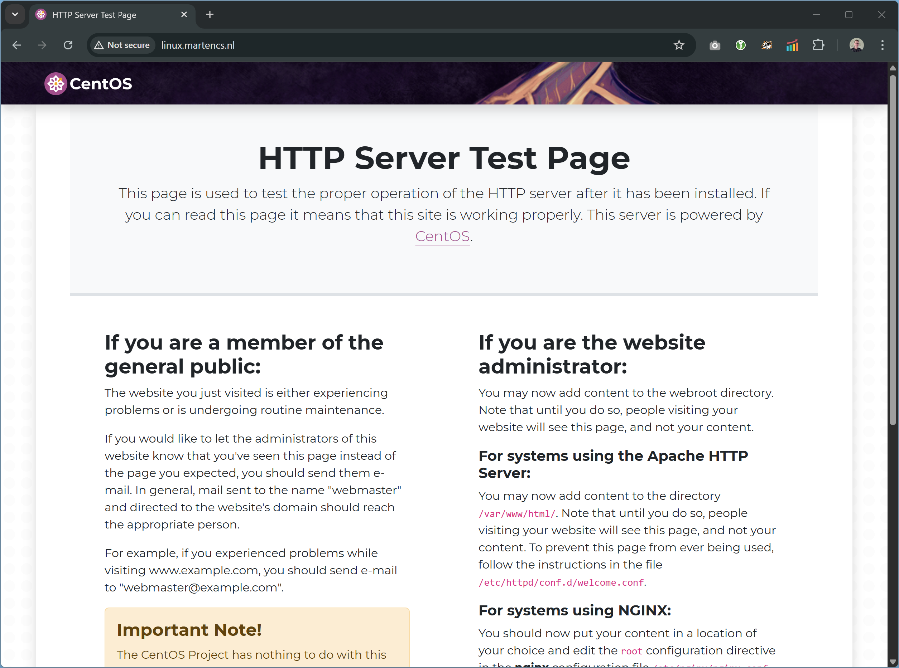

# Linux Server project

## Use case
In onze opleiding Softwaredeveloper leren de studenten websites te bouwen. Hiervoor leren ze HTML/CSS voor de opmaak en gebruiken ze PHP als server-side scripttaal.

Op dit moment gebruiken de studenten hun eigen laptop samen met XAMPP om deze websites te “runnen” en voor ontwikkeldoeleinden voldoet dit prima.
Echter willen we de studenten ook leren hoe ze een website “echt” online kunnen zetten, zodat ze deze vanaf het internet kunnen benaderen. Op deze manier:

- Krijgen ze een beter inzicht in hoe een website “online” gezet kan worden en waar je dan rekening mee moet houden bij het bouwen van je website (zoals het gebruik van relatieve paden)
- Kunnen ze wat ze geleerd/gemaakt hebben laten zien aan ouders, familie, vrienden
- Kunnen ze een zelfgemaakt Curriculum Vitae en Portfolio hosten, om bijvoorbeeld aan bedrijven te laten zien.

## Ontwerp
Om bovenstaande mogelijk te maken voor de studenten wil ik een Linux-server inrichten. Zij moeten daarbij hun website-bestanden op deze server kunnen zetten en deze vervolgens kunnen weergeven in de browser.
Hiervoor wordt op de server voor elke student een gebruiker aangemaakt. Deze gebruiker kan door middel van FTP website-bestanden op de server zetten, welke vervolgens door een webserver worden geserveerd.

Om dit te realiseren heb ik het volgende plan gemaakt voor de volgende inrichting van de server:

### Gebruikers

Voor elke student wordt een gebruiker aangemaakt op het systeem op basis van hun studentnummer (bijv. s0330828). Deze gebruiker krijgt een directory waar ze hun website-bestanden kunnen plaatsen (praktisch moet uitgezocht worden of dit een directory is in de home directory van de gebruiker of een andere plek).

### Webserver

Een Apache webserver, waarbij elke student een unieke URL krijgt voor zijn webpagina’s, bijvoorbeeld https://example.com/s0330828 welke verwijst naar de directory van deze gebruiker.
Om dit veilig te maken wordt gebruik gemaakt van https (SSL).

### FTP-server

Een FTP-server, waarbij elke student door middel van zijn studentnummer (bijvoorbeeld s0330828) kunnen inloggen. Zij komen dan uit op de directory waar ze hun website-bestanden kunnen plaatsen. Uiteraard is dit de enige directory die zij kunnen zien.

Om dit veilig te maken wordt gebruik gemaakt van SFTP of FTPS (nader te onderzoeken, vermoedelijk SFTP).

### Onderhoudsscripts

Om het mogelijk te maken de bovenstaande configuratie te beheren, worden er onderhoudsscripts gemaakt. De volgende scripts heb ik in gedachten:

1. Een script waarmee op eenvoudige wijze ruimte voor een student kan worden aangemaakt op de server, inclusief inlogmogelijkheid e.d. 
2.	Een script waarmee op eenvoudige wijze ruimte voor een student kan worden verwijderd (bonus: met een grace period ingebouwd).

### Domeinnaam-resolutie

Het is wenselijk dat de webserver en ftp-server bereikbaar zijn onder een domeinnaam. Hiervoor moet de domeinnaam omgezet worden naar een IP door middel van een DNS-server.

Dit wordt gerealiseerd door middel van een aangepaste hosts file op de client of een DNS-record op een bestaande DNS-server. Er wordt geen DNS-server ingericht.

### Overige eisen
Overige eisen voor de server benoemd in de opdracht worden meegenomen tijdens de installatie, zoals backups, beveiliging van de server, alleen benodigde services, etc.

### Out of scope
***Database-server:*** voor uitgebreidere websites wordt vaak een database gebruikt om gegevens in op te slaan.  We gaan in deze use-case uit van eenvoudige (semi-statische) websites, waarbij geen data worden opgeslagen in een database. De installatie van een databaseserver valt dan ook buiten de scope van de opdracht.

## Eisen

Aanvullende eisen voor de server:

- Verplicht op CentOS (afwijken in overleg met de docent)
- Zo kaal mogelijk draaien, geen overbodige services.
- Beheerders en testusers zijn aangemaakt.
- Maximale beveiliging.
- Vaste IP-adressen gebruiken
- Volledig gepatched en ge-updated.
- Alles commando-based.
- Bij reboot moet alles automatisch gestart worden
- Backup en restore procedure
- Minimaal 2 onderhoudsscripts
- SSH service voor beheer op afstand
- Koppeling met NTP server
- Logging
- Defensieve permissiestructuur (alleen rechten daar waar nodig)

## Installatie Linux
Voor de installatie wordt de Linux distributie CentOS Stream 10 gebruikt. Hiervoor wordt een Virtual Machine aangemaakt in VMWare met 2GB geheugen, 2 processoren en 30GB harddisk.

Tijdens de installatie wordt een gebruiker aangemaakt “marten” met als wachtwoord “marten”.

Na inloggen op de installatie wordt deze eerst via de terminal geüpdatet naar de laatste versie door middel van:

```sudo dnf clean all```

```sudo dnf update -y```

Bovenstaande verwijdert gecachte metadata en installeert de laatste updates van de CentOS repository

Omdat mogelijk de kernel is geüpdatet, voeren we een reboot uit:

```sudo reboot```

## Statisch IP adres instellen

Wijzigen van het IP-adres naar een statisch IP, zodat dit niet meer wijzigt na een reboot. Op deze manier is de server vanaf de host altijd via dit IP benaderbaar. Dit is ook belangrijk voor het straks verwijzen naar deze server d.m.v. een domeinnaam.

```sudo nmcli con modify ens33 ipv4.addresses 172.24.245.109/20```

```sudo nmcli con modify ens33 ipv4.gateway 172.24.240.1```

```sudo nmcli con modify ens33 ipv4.dns "172.24.240.1"```

```sudo nmcli con modify ens33 ipv4.method manual```

Na de wijzigingen de netwerkadapter uit- en inschakelen, zodat deze instellingen actief worden:

```sudo nmcli con down ens33```

```sudo nmcli con up ens33```

Controleren of de configuratie goed is gegaan:

```ip adress```

Geeft:

```
2: ens33: <BROADCAST,MULTICAST,UP,LOWER_UP> mtu 1500 qdisc fq_codel state UP group default qlen 1000
    link/ether 00:0c:29:ec:e2:eb brd ff:ff:ff:ff:ff:ff
    altname enp2s1
    altname enx000c29ece2eb
    inet 172.23.88.98/20 brd 172.23.95.255 scope global noprefixroute ens33
       valid_lft forever preferred_lft forever
    inet6 fe80::20c:29ff:feec:e2eb/64 scope link noprefixroute 
       valid_lft forever preferred_lft forever
```


## Domeinnaamverwijzing

Om de server bereikbaar te maken onder een domeinnaam moet deze toegevoegd worden aan een DNS-server d.m.v. een zogenaamd A-record.

Het volgende record is toegevoegd aan de nameserver voor martencs.nl:

```DNS
linux.martencs.nl.	0	IN	A	172.24.245.109
```

Vervolgens is op de server gecontroleerd of deze juist _resolved_:

```dig +short A linux.martencs.nl```

Met als resultaat:

```
172.24.245.109
```

Dit betekent dat nu ook bijvoorbeeld de volgende URL's kunnen worden gebruikt vanaf het host-systeem om de server te benaderen:

- http://linux.martencs.nl/
- http://linux.martencs.nl/alice

## Installatie Apache webserver en PHP
We willen een webserver draaien waarbij gebruik kan worden gemaakt van PHP. Daarvoor installeren we Apache en starten we deze:

```sudo dnf install httpd -y```

```sudo systemctl enable --now httpd```

Om te controleren dat Apache draait typen we:

```sudo systemctl status httpd```


Vervolgens moeten we de server nog beschikbaar maken van buitenaf, door de firewall te configureren:

```sudo firewall-cmd --permanent --add-service=http```

```sudo firewall-cmd --reload```

We gaan nu op de host-machine in browser naar http://linux.martencs.nl om te controleren of de server extern bereikbaar is. Dit geeft het volgende resultaat:



Om vervolgens PHP te installeren:

```sudo dnf install php php-common php-opcache -y```

Dit installeert de PHP packages die nodig zijn om PHP op de webserver te kunnen gebruiken (en een caching-package voor performance)

Start de Apache server opnieuw op:

```sudo systemctl restart httpd```

Om te controleren dat PHP werkt, start nano (tekstverwerker):

```sudo nano /var/www/html/info.php```

En type de volgende code:

```<?php phpinfo(); ?>```

Sla op met <kbd>CTRL</kbd>+<kbd>O</kbd> en <kbd>ENTER</kbd> en sluit af met <kbd>CTRL</kbd>-<kbd>X</kbd>

Roep vervolgens in de browser de volgende pagina op http://linux.martencs.nl/info.php. Dit geeft het volgende resultaat:


## Webfolder aanmaken voor student
Het aanmaken van een webfolder (een locatie waar de gebruiker zijn webpagina’s kan plaatsen) gebeurt door middel van een script. Voordat dit script kan worden uitgevoerd moet worden aangegeven dat SELinux niet moet blokkeren dat Apache home-directories kan benaderen:

```sudo setsebool -P httpd_enable_homedirs on```

Het script om de webfolder aan te maken voor de student vraagt als parameter de studentcode van de student:

- Het maakt een gebruiker aan op basis van de studentcode zonder wachtwoord, zodat de student niet met een wachtwoord kan inloggen
- Het maakt een folder ~/public_html aan, de “webfolder” voor de student
- Het maakt deze folder onder Apache beschikbaar onder /studentcode
- Het genereert een public en private key t.b.v. SFTP (SSH-FTP)
- Het maakt de home-folder van de student beschikbaar via SFTP, waarbij alleen gebruik kan worden gemaakt van een private key (en dus niet van een wachtwoord)
- Het stelt in dat alleen, SFTP kan worden gebruikt en geen SSH


Dit script wordt op de volgende manier aangemaakt:

```nano create_student_site.sh```

> ℹ️ De code voor dit script is te vinden in [create_student_site.sh](create_student_site.sh). Dit script is voorzien van commentaar om de bovenstaande functionaliteiten van het script verder uit te leggen.

Sla op met <kbd>CTRL</kbd>+<kbd>O</kbd> en <kbd>ENTER</kbd> en sluit af met <kbd>CTRL</kbd>-<kbd>X</kbd>

Om het script te kunnen uitvoeren moet het executable gemaakt worden:

```chmod +x create_student_site.sh```

Om vervolgens een gebruiker en home-folder aan te maken voor alice en deze folder toegankelijk te maken via SFTP, gebruik makend van een private key, kan het script als volgt worden aangeroepen:

```./create_student_site.sh alice```

Je kunt nu vanaf de host navigeren naar http://linux.martencs.nl/alice. Dit geeft het volgende resultaat:


Ook kan alice nu SFTP gebruiken vanaf een andere machine. Hiervoor moet de private key die getoond wordt in de output van het script worden opgeslagen worden in het bestand alice.key op de machine waar vanaf ze wil connecten. Vervolgens kan door middel van het volgende commando op deze machine een sftp-sessie worden gestart:

```sftp -i alice.key alice@linux.martencs.nl```

SSH wordt geweigerd:

```ssh -i alice.key alice@linux.martencs.nl```

Resultaat:


Voor de gebruiker _marten_ kan ook een webfolder aangemaakt en SFTP toegang geconfigureerd:

```./create_student_site.sh marten```

Om daarna toegang via SSH te behouden, is vervolgens het volgende in /etc/sshd_config aangepast:

```
Match User marten
    ForceCommand internal-sftp
    ChrootDirectory /home/marten
    AllowTcpForwarding no
    X11Forwarding no
    PasswordAuthentication no
```
naar:

```
Match User marten
    AllowTcpForwarding no
    X11Forwarding no
    PasswordAuthentication no
```

Hiermee wordt de gebruiker _marten_ niet meer beperkt tot SFTP en niet gelockt in zijn eigen home directory.

Wanneer nu bijvoorbeeld met WinSCP een SFTP-connectie wordt gemaakt, resulteert dat in de volgende verbinding:"


## Webfolder verwijderen voor de student

Het is ook wenselijk om webfolders van studenten weer op te kunnen ruimen. Ook hiervoor is een script gemaakt.

Het script om de webfolder weer te verwijderen voor de student vraagt als parameter de studentcode van de student:

- Het verwijdert de folder onder /studentcode in Apache
- Het verwijdert de SFTP-configuratie
- Het verwijdert (optioneel) de gebruiker
  - Maakt een backup van de home folder
  - Verwijdert de gebruiker
  - Verwijdert de home folder
  - Doet dit alleen wanneer de gebruiker geen systeem/admin gebruiker is

Dit script wordt op de volgende manier aangemaakt:

```nano remove_student_site.sh```

> ℹ️ De code voor dit script is te vinden in [remove_student_site.sh](remove_student_site.sh). Dit script is voorzien van commentaar om de bovenstaande functionaliteiten van het script verder uit te leggen.

Om het script te kunnen uitvoeren moet het executable gemaakt worden:

```chmod +x remove_student_site.sh```

Om vervolgens een gebruiker en home-folder aan te maken voor alice en deze folder toegankelijk te maken via SFTP, gebruik makend van een private key, kan het script als volgt worden aangeroepen:

```./remove_student_site.sh alice```

Wanneer ook de gebruiker moet worden verwijderd:

```./remove_student_site.sh alice delete```

## HTTPS activeren

### Tools installeren voor certificaat aanvraag

Om een domeincertificaat aan te maken maken we gebruik van certbot, een tool die een certificaat kan aanvragen bij Let's Encrypt, een organisatie die domein-certificaten uitgeeft. Hiervoor moet certbot eerst geinstalleerd worden. 

Hiervoor installeren we achtereenvolgens:
- EPEL - Extra Packages for Enterprise Linux, nodig om Snap te kunnen installeren

  ```sudo dnf install epel-release -y```

- Snap - Een package manager ontwikkeld door Canonical, nodig om Certbot te kunnen installeren

  ```sudo dnf install snapd -y```  

  ```sudo systemctl enable --now snapd.socket```

  ```sudo ln -s /var/lib/snapd/snap /snap```

- Certbot - Certbot is de tool om SSL-certificaten van Let's Encrypt aan te vragen

  ```sudo snap install --classic certbot```

  ```sudo ln -s /snap/bin/certbot /usr/bin/certbot```

### Certificaat aanvragen
Vervolgens maken we een certificaat aan voor het domein linux.martencs.nl. Omdat dit domein niet van buitenaf door Let's Encrypt te bereiken is (maar alleen vanaf onze host computer), gebruiken we de optie om een TXT-record toe te voegen aan de DNS om te bewijzen dat het domein van ons is.
Dat doen we als volgt:


```sudo certbot certonly --manual --preferred-challenges dns -d linux.martencs.nl```

Certbot vraagt vervolgens om een TXT record aan te maken


Het volgende record is toegevoegd aan de nameserver:

```DNS
_acme-challenge.linux.martencs.nl. 0 IN	TXT	"PX13ign088uv-s0E9hfpHAe0fB_70ZHqEIof5LWi6RY"
```

Vervolgens is op de server gecontroleerd of deze juist _resolved_:

```dig +short TXT _acme-challenge.linux.martencs.nl```

Met als resultaat:

```
"PX13ign088uv-s0E9hfpHAe0fB_70ZHqEIof5LWi6RY"
```

Na verificatie van het domein is het certificaat aangemaakt in de folder ```/etc/letsencrypt/live/linux.martencs.nl/```

Er staan hier twee bestanden:

- ```fullchain.pem``` - het volledige certificaat (cert en chain)

- ```privkey.pem``` - de private key

### HTTPS Configureren

Om gebruik te kunnen maken van SSL moeten we deze module in Apache toevoegen:

```sudo dnf install mod_ssl -y```

Om Apache te laten luisteren op poort 443 moet de configuratie worden aangepast:

```sudo nano /etc/httpd/conf/httpd.conf```

Voeg hieraan de volgende regel toe (dit kan bovenin het bestand):

```
ServerName linux.martencs.nl
```

En voeg onder de regel "Listen 80" de regel "Listen 443" toe:

```
Listen 80
Listen 433
```

Vervolgens moet Apache verteld worden voor linux.martencs.nl te luisteren op poort 443 en daarbij de eerder aangemaakte certificaten te gebruiken voor een beveiligde verbinding:

```sudo nano /etc/httpd/conf.d/linux.martencs.nl.conf```

Zet het volgende in dit bestand:
```
<VirtualHost *:443>
    ServerName linux.martencs.nl

    DocumentRoot /var/www/html

    SSLEngine on
    SSLCertificateFile /etc/letsencrypt/live/linux.martencs.nl/fullchain.pem
    SSLCertificateKeyFile /etc/letsencrypt/live/linux.martencs.nl/privkey.pem

    <Directory /var/www/html>
        Options Indexes FollowSymLinks
        AllowOverride None
        Require all granted
    </Directory>

    ErrorLog logs/linux.martencs.nl-ssl-error.log
    CustomLog logs/linux.martencs.nl-ssl-access.log combined
</VirtualHost>

```

Start vervolgens Apache opnieuw:

```sudo systemctl restart httpd```

Als laatste moeten we ook de firewall nog configureren om https door te laten:

```sudo firewall-cmd --permanent --add-service=https```

```sudo firewall-cmd --reload```

Het is nu mogelijk om de server via HTTPS te benaderen:

- https://linux.martencs.nl
- https://linux.martencs.nl/alice

