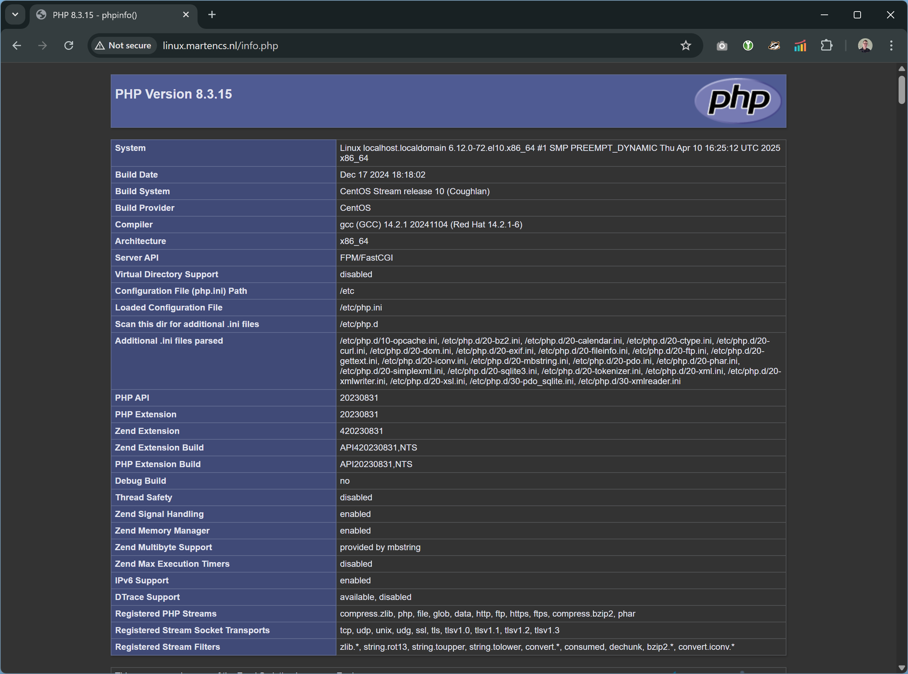

# Linux Server project - Handleiding / instructie


<table>
<tr><td>Naam</td><td>Marten Schukkink</td></tr>
<tr><td>Studentnummer</td><td>s1205450</td></tr>
<tr><td>Opleiding</td><td>Lerarenopleiding technisch beroepsonderwijs via Kopopleiding</td></tr>
<tr><td>School</td><td>Windesheim</td></tr>
<tr><td>Af te ronden onderwijseenheid</td><td>ENBO-ICT.B4.X.22 Linux</td></tr>
<tr><td>Docent</td><td>Jan Verbaan</td></tr>
</table>


### Gebruik van AI

Tijdens de voorbereiding van dit werk heb ik ChatGPT (GPT 4o) gebruikt om te helpen bij het configureren van de Linux server die voor deze opdracht moet worden gerealiseerd. Hierbij heb ik ChatGTP gevraagd om voorstellen te doen voor de implementatie van verschillende onderdelen van de opdracht. Deze voorstellen zijn daarna doorgevoerd, waarbij vrijwel altijd aanpassingen zijn gedaan aangezien de context waarin de opdracht wordt uitgevoerd afwijkt van de context waarbinnen ChatGPT een antwoord formuleert. 

Na het gebruik van deze tool heb ik de uitkomsten ervan uitvoerig aangepast om ervoor te zorgen dat mijn werk, mijn eigen competenties en leeruitkomsten reflecteert. Ik draag de volledig verantwoordelijkheid voor de inhoud van dit werk. Ik ben me ervan bewust dat mijn handelen of
nalaten van handelen dat erop is gericht of tot gevolg heeft dat het vormen van een juist oordeel omtrent mijn kennis, inzicht en vaardigheden wordt belemmerd, kan worden beschouwd als fraude. Ik ben mij ervan bewust dat het letterlijk overnemen van stukken tekst/code, etc van een AI
een juist oordeel over mijn kennis en vaardigheden in de weg staat en dus beschouwd wordt als fraude.

## Use case
In onze opleiding Softwaredeveloper leren de studenten websites te bouwen. Hiervoor leren ze HTML/CSS voor de opmaak en gebruiken ze PHP als server-side scripttaal.

Op dit moment gebruiken de studenten hun eigen laptop samen met XAMPP om deze websites te “runnen” en voor ontwikkeldoeleinden voldoet dit prima.
Echter willen we de studenten ook leren hoe ze een website “echt” online kunnen zetten, zodat ze deze vanaf het internet kunnen benaderen. Op deze manier:

- Krijgen ze een beter inzicht in hoe een website “online” gezet kan worden en waar je dan rekening mee moet houden bij het bouwen van je website (zoals het gebruik van relatieve paden)
- Kunnen ze wat ze geleerd/gemaakt hebben laten zien aan ouders, familie, vrienden
- Kunnen ze een zelfgemaakt Curriculum Vitae en Portfolio hosten, om bijvoorbeeld aan bedrijven te laten zien.

## Ontwerp
Om bovenstaande mogelijk te maken voor de studenten wil ik een Linux-server inrichten. Zij moeten daarbij hun website-bestanden op deze server kunnen zetten en deze vervolgens kunnen weergeven in de browser.
Hiervoor wordt op de server voor elke student een gebruiker aangemaakt. Deze gebruiker kan door middel van FTP website-bestanden op de server zetten, welke vervolgens door een webserver worden geserveerd.

Om dit te realiseren heb ik het volgende plan gemaakt voor de volgende inrichting van de server:

### Gebruikers

Voor elke student wordt een gebruiker aangemaakt op het systeem op basis van hun studentnummer (bijv. s0330828). Deze gebruiker krijgt een directory waar ze hun website-bestanden kunnen plaatsen (praktisch moet uitgezocht worden of dit een directory is in de home directory van de gebruiker of een andere plek).

### Webserver

Een Apache webserver, waarbij elke student een unieke URL krijgt voor zijn webpagina’s, bijvoorbeeld https://example.com/s0330828 welke verwijst naar de directory van deze gebruiker.
Om dit veilig te maken wordt gebruik gemaakt van https (SSL).

### FTP-server

Een FTP-server, waarbij elke student door middel van zijn studentnummer (bijvoorbeeld s0330828) kunnen inloggen. Zij komen dan uit op de directory waar ze hun website-bestanden kunnen plaatsen. Uiteraard is dit de enige directory die zij kunnen zien.

Om dit veilig te maken wordt gebruik gemaakt van SFTP of FTPS (nader te onderzoeken, vermoedelijk SFTP).

### Onderhoudsscripts

Om het mogelijk te maken de bovenstaande configuratie te beheren, worden er onderhoudsscripts gemaakt. De volgende scripts heb ik in gedachten:

1. Een script waarmee op eenvoudige wijze ruimte voor een student kan worden aangemaakt op de server, inclusief inlogmogelijkheid e.d. 
2.	Een script waarmee op eenvoudige wijze ruimte voor een student kan worden verwijderd (bonus: met een grace period ingebouwd).

### Domeinnaam-resolutie

Het is wenselijk dat de webserver en ftp-server bereikbaar zijn onder een domeinnaam. Hiervoor moet de domeinnaam omgezet worden naar een IP door middel van een DNS-server.

Dit wordt gerealiseerd door middel van een aangepaste hosts file op de client of een DNS-record op een bestaande DNS-server. Er wordt geen DNS-server ingericht.

### Aanvullende eisen
Overige eisen voor de server benoemd in de opdracht worden meegenomen tijdens de installatie. Aanvullende eisen voor de server zijn:

- Verplicht op CentOS (afwijken in overleg met de docent)
- Zo kaal mogelijk draaien, geen overbodige services.
- Beheerders en testusers zijn aangemaakt.
- Maximale beveiliging.
- Vaste IP-adressen gebruiken
- Volledig gepatched en ge-updated.
- Alles commando-based.
- Bij reboot moet alles automatisch gestart worden
- Backup en restore procedure
- Minimaal 2 onderhoudsscripts
- SSH service voor beheer op afstand
- Koppeling met NTP server
- Logging
- Defensieve permissiestructuur (alleen rechten daar waar nodig)

### Out of scope
***Database-server:*** voor uitgebreidere websites wordt vaak een database gebruikt om gegevens in op te slaan.  We gaan in deze use-case uit van eenvoudige (semi-statische) websites, waarbij geen data worden opgeslagen in een database. De installatie van een databaseserver valt dan ook buiten de scope van de opdracht.

## Opbouw van deze handleiding/instructie

Deze handleiding/instructie legt uit hoe het bovenstaande ontwerp is gerealiseerd. Hierbij beschrijven punten 2 t/m 7 met name de gerealiseerde functionaliteiten

1. [Installatie Linux](#installatie-linux)
2. [Statisch IP adres instellen](#statisch-ip-adres-instellen)
3. [Domeinnaamverwijzing](#domeinnaamverwijzing)
4. [Installatie Apache webserver en PHP](#installatie-apache-webserver-en-php)
5. [Webfolder aanmaken voor student](#webfolder-aanmaken-voor-student)
6. [Webfolder verwijderen voor student](#webfolder-verwijderen-voor-de-student)
7. [HTTPS activeren](#https-activeren)
   - [Tools installeren voor certificaat aanvraag](#tools-installeren-voor-certificaat-aanvraag)
   - [Certificaat aanvragen](#certificaat-aanvragen)
   - [HTTPS configureren](#https-configureren)
8. [Security en logging](#security-en-logging)
   - [Verwijderen van onnodige services](#verwijderen-van-onnodige-services)
   - [Beperken open poorten](#beperken-open-poorten)
   - [Syslog en audit](#syslog-en-audit)
9. [Backup](#backup)
   - [Backup-disk toevoegen en mounten](#backup-disk-toevoegen-en-mounten)
   - [Dagelijkse backup](#dagelijkse-backup)

## Installatie Linux
Voor de installatie is de Linux distributie CentOS Stream 10 gebruikt. Hiervoor is een Virtual Machine aangemaakt in VMWare met 2GB geheugen, 2 processoren en 30GB harddisk.

Tijdens de installatie is een gebruiker aangemaakt “marten” met als wachtwoord “marten”.

Na inloggen op de installatie is deze eerst via de terminal geüpdatet naar de laatste versie door middel van:

```sudo dnf clean all```

```sudo dnf update -y```

Bovenstaande verwijdert gecachte metadata en installeert de laatste updates van de CentOS repository

Omdat mogelijk de kernel is geüpdatet, is een reboot uitgevoerd:

```sudo reboot```

## Statisch IP adres instellen

Het dynamische IP-adres is gewijzigd naar een statisch IP, zodat dit niet meer wijzigt na een reboot. Op deze manier is de server vanaf de host altijd via dit IP benaderbaar. Dit is ook belangrijk voor het straks verwijzen naar deze server d.m.v. een domeinnaam.

```sudo nmcli con modify ens33 ipv4.addresses 172.24.245.109/20```

```sudo nmcli con modify ens33 ipv4.gateway 172.24.240.1```

```sudo nmcli con modify ens33 ipv4.dns "172.24.240.1"```

```sudo nmcli con modify ens33 ipv4.method manual```

Na de wijzigingen is de netwerkadapter uit- en ingeschakeld, zodat deze instellingen actief worden:

```sudo nmcli con down ens33```

```sudo nmcli con up ens33```

Vervolgens is gecontroleerd of de configuratie goed is gegaan:

```
marten@localhost:~$ ip address
[...]
2: ens33: <BROADCAST,MULTICAST,UP,LOWER_UP> mtu 1500 qdisc fq_codel state UP group default qlen 1000
    link/ether 00:0c:29:ec:e2:eb brd ff:ff:ff:ff:ff:ff
    altname enp2s1
    altname enx000c29ece2eb
    inet 172.24.245.109/20 brd 172.24.255.255 scope global noprefixroute ens33
       valid_lft forever preferred_lft forever
    inet6 fe80::20c:29ff:feec:e2eb/64 scope link noprefixroute 
       valid_lft forever preferred_lft forever
```


## Domeinnaamverwijzing

Om de server bereikbaar te maken onder een domeinnaam moet deze toegevoegd worden aan een DNS-server d.m.v. een zogenaamd A-record.

Het volgende record is toegevoegd aan de nameserver voor martencs.nl:

```DNS
linux.martencs.nl.	0	IN	A	172.24.245.109
```

Vervolgens is op de server gecontroleerd of deze juist _resolved_:

```
marten@localhost:~$ dig +short A linux.martencs.nl
172.24.245.109
```

Op deze manier is de machine ook bereikbaar via de hostname ```linux.martencs.nl``` in plaats van het IP. Dit is belangrijk voor de installatie van de Apache server en het activeren van HTTPS. 

## Installatie Apache webserver en PHP
We willen een webserver draaien waarbij gebruik kan worden gemaakt van PHP. Daarvoor is  Apache geinstalleerd en gestart:

```sudo dnf install httpd -y```

```sudo systemctl enable --now httpd```

Om te controleren dat Apache draait typen we:

```sudo systemctl status httpd```


Vervolgens isde server beschikbaar gesteld van buitenaf, door de firewall te configureren:

```sudo firewall-cmd --permanent --add-service=http```

```sudo firewall-cmd --reload```

Daarna is gecontroleerd of de server extern bereikbaar is door op de host-machine in de browser naar http://linux.martencs.nl te gaan. Dit geeft het volgende resultaat:


Vervolgens is PHP geinstalleerd:

```sudo dnf install php php-common php-opcache -y```

Dit installeert de PHP packages die nodig zijn om PHP op de webserver te kunnen gebruiken (en een caching-package voor performance)

De Apache server is daarna opnieuw opgestart met:

```sudo systemctl restart httpd```

Om te controleren dat PHP werkt, is een PHP-bestand aangemaakt d.m.v. _nano_ (texteditor):

```sudo nano /var/www/html/info.php```

Hierin is code gezet om informatie te tonen over php (de functie phpinfo() wordt hierin aangeroepen):

```<?php phpinfo(); ?>```

Het bestand daarna is opgeslagen met <kbd>CTRL</kbd>+<kbd>O</kbd> en <kbd>ENTER</kbd> en nano afgesloten met <kbd>CTRL</kbd>-<kbd>X</kbd>

Vervolgens is in de browser van de host de volgende pagina aangeroepen: http://linux.martencs.nl/info.php. Dit geeft het volgende resultaat:



## Webfolder aanmaken voor student
Het aanmaken van een webfolder (een locatie waar de gebruiker zijn webpagina’s kan plaatsen) gebeurt door middel van een script dat door mij is gemaakt. Voordat dit script kan worden uitgevoerd moet worden aangegeven dat SELinux niet moet blokkeren dat Apache home-directories kan benaderen:

```sudo setsebool -P httpd_enable_homedirs on```

Het script om de webfolder aan te maken voor de student vraagt als parameter de studentcode van de student en voert vervolgens de volgende acties uit:

- Het maakt een gebruiker aan op basis van de studentcode zonder wachtwoord, zodat de student niet met een wachtwoord kan inloggen
- Het maakt een folder ~/public_html aan, de “webfolder” voor de student
- Het maakt deze folder onder Apache beschikbaar onder /studentcode
- Het genereert een public en private key t.b.v. SFTP (SSH-FTP)
- Het maakt de home-folder van de student beschikbaar via SFTP, waarbij alleen gebruik kan worden gemaakt van een private key (en dus niet van een wachtwoord)
- Het stelt in dat alleen, SFTP kan worden gebruikt en geen SSH


Dit script is door middel van _nano_ aangemaakt:

```nano create_student_site.sh```

> ℹ️ **De code voor dit script is te vinden in [create_student_site.sh](create_student_site.sh). Dit script is voorzien van commentaar om de bovenstaande functionaliteiten van het script verder uit te leggen.**

Het bestand daarna is opgeslagen met <kbd>CTRL</kbd>+<kbd>O</kbd> en <kbd>ENTER</kbd> en nano afgesloten met <kbd>CTRL</kbd>-<kbd>X</kbd>

Om het script te kunnen uitvoeren is het executable gemaakt:

```chmod +x create_student_site.sh```

Om vervolgens de gebruiker en home-folder aan te maken voor de gebruiker _alice_ en deze folder toegankelijk te maken via SFTP, gebruik makend van een private key, is het script als volgt aangeroepen:

```./create_student_site.sh alice```

Om te controleren of de home-folder is aangemaakt, is vervolgens op de host genavigeerd naar http://linux.martencs.nl/alice. Dit gaf het volgende resultaat:


Ook kan alice nu SFTP gebruiken vanaf een andere machine. Hiervoor moet de private key die getoond wordt in de output van het script worden opgeslagen worden in het bestand alice.key op de machine waar vanaf ze wil connecten. Vervolgens kan door middel van het volgende commando op deze machine een sftp-sessie worden gestart:

```sftp -i alice.key alice@linux.martencs.nl```

SSH wordt geweigerd:

```ssh -i alice.key alice@linux.martencs.nl```

Resultaat:


Voor de gebruiker _marten_ is ook een webfolder aangemaakt en SFTP toegang geconfigureerd:

```./create_student_site.sh marten```

Om daarna toegang via SSH te behouden, is vervolgens het volgende in /etc/sshd_config aangepast:

```
Match User marten
    ForceCommand internal-sftp
    ChrootDirectory /home/marten
    AllowTcpForwarding no
    X11Forwarding no
    PasswordAuthentication no
```
naar:

```
Match User marten
    AllowTcpForwarding no
    X11Forwarding no
    PasswordAuthentication no
```

Hiermee is de gebruiker _marten_ niet meer beperkt tot SFTP en niet gelockt in zijn eigen home directory.

Wanneer nu bijvoorbeeld met WinSCP een SFTP-connectie wordt gemaakt, resulteert dat in de volgende verbinding:


## Webfolder verwijderen voor de student

Het is ook wenselijk om webfolders van studenten weer op te kunnen ruimen. Ook hiervoor is een script gemaakt.

Het script om de webfolder weer te verwijderen voor de student vraagt als parameter de studentcode van de student en voert vervolgens de volgende acties uit:

- Het verwijdert de folder onder /studentcode in Apache
- Het verwijdert de SFTP-configuratie
- Het verwijdert (optioneel) de gebruiker
  - Maakt een backup van de home folder
  - Verwijdert de gebruiker
  - Verwijdert de home folder
  - Doet dit alleen wanneer de gebruiker geen systeem/admin gebruiker is

Dit script is ook door middel van _nano_ aangemaakt:

```nano remove_student_site.sh```

> ℹ️ **De code voor dit script is te vinden in [remove_student_site.sh](remove_student_site.sh). Dit script is voorzien van commentaar om de bovenstaande functionaliteiten van het script verder uit te leggen.**

Om het script te kunnen uitvoeren is het executable gemaakt:

```chmod +x remove_student_site.sh```

Om vervolgens de home-folder en SFTP-toegang te verwijderen, kan het script als volgt worden aangeroepen:

```./remove_student_site.sh alice```

Wanneer ook de gebruiker moet worden verwijderd:

```./remove_student_site.sh alice delete```

## HTTPS activeren
Om HTTPS te kunnen gebruiken op de webserver, moet een TLS/SSL-certificaat aanwezig zijn op de server, waarmee het verkeer tussen server en client versleuteld kan worden. Dit kan met een _self signed_ certificaat voor testdoeleinden, maar in een productieomgeving zoals deze moet het certificaat aangevraagd worden via een Certificate Authority (CA). _Let's Encrypt_ is zo'n CA, waar je kostenloos een TLS/SSL-certificaat kan aanvragen. Het certificaat is een _[domain-validated certificate](https://en.wikipedia.org/wiki/Domain-validated_certificate)_ wat betekent dat het uitgegeven wordt nadat je bewezen hebt dat je controle hebt over het domein.

### Tools installeren voor certificaat aanvraag

Om een certificaat aan te maken is gebruik gemaakt van certbot, een tool die een certificaat aanvraagt bij Let's Encrypt. Hiervoor moet certbot eerst geinstalleerd worden. 

Hiervoor is achtereenvolgens geinstalleerd:
- EPEL - Extra Packages for Enterprise Linux, nodig om Snap te kunnen installeren

  ```sudo dnf install epel-release -y```

- Snap - Een package manager ontwikkeld door Canonical, nodig om Certbot te kunnen installeren

  ```sudo dnf install snapd -y```  

  ```sudo systemctl enable --now snapd.socket```

  ```sudo ln -s /var/lib/snapd/snap /snap```

- Certbot - Certbot is de tool om SSL-certificaten van Let's Encrypt aan te vragen

  ```sudo snap install --classic certbot```

  ```sudo ln -s /snap/bin/certbot /usr/bin/certbot```

### Certificaat aanvragen
Vervolgens is een certificaat aangemaakt voor het domein linux.martencs.nl. Omdat dit domein niet van buitenaf door Let's Encrypt te bereiken is (maar alleen vanaf onze host computer), hebben we de optie gebruikt om een TXT-record toe te voegen aan de DNS om te bewijzen dat het domein van ons is. Dat hebben we als volgt gedaan:


```sudo certbot certonly --manual --preferred-challenges dns -d linux.martencs.nl```

Certbot vraagt vervolgens om een TXT record aan te maken


Het volgende record is toegevoegd aan de nameserver:

```DNS
_acme-challenge.linux.martencs.nl. 0 IN	TXT	"PX13ign088uv-s0E9hfpHAe0fB_70ZHqEIof5LWi6RY"
```

Vervolgens is op de server gecontroleerd of deze juist _resolved_:

```
marten@localhost:~$ dig +short TXT _acme-challenge.linux.martencs.nl
"PX13ign088uv-s0E9hfpHAe0fB_70ZHqEIof5LWi6RY"
```

Na verificatie van het domein is het certificaat aangemaakt in de folder /etc/letsencrypt/live/linux.martencs.nl/. Er staan hier twee bestanden:

- ```fullchain.pem``` - het volledige certificaat (cert en chain)

- ```privkey.pem``` - de private key

### HTTPS Configureren

Om gebruik te kunnen maken van SSL is deze module in Apache toegevoegd:

```sudo dnf install mod_ssl -y```

Om Apache te laten luisteren op poort 443 is de configuratie aangepast:

```sudo nano /etc/httpd/conf/httpd.conf```

Hieraan is de volgende regel toegevoegd (dit kan bovenin het bestand):

```
ServerName linux.martencs.nl
```

En is de regel "Listen 80" onder de regel "Listen 443" toegevoegd:

```
Listen 80
Listen 433
```

Vervolgens is Apache verteld voor linux.martencs.nl te luisteren op poort 443 en daarbij de eerder aangemaakte certificaten te gebruiken voor een beveiligde verbinding:

```sudo nano /etc/httpd/conf.d/linux.martencs.nl.conf```

Zet het volgende in dit bestand:
```
<VirtualHost *:443>
    ServerName linux.martencs.nl

    DocumentRoot /var/www/html

    SSLEngine on
    SSLCertificateFile /etc/letsencrypt/live/linux.martencs.nl/fullchain.pem
    SSLCertificateKeyFile /etc/letsencrypt/live/linux.martencs.nl/privkey.pem

    <Directory /var/www/html>
        Options Indexes FollowSymLinks
        AllowOverride None
        Require all granted
    </Directory>

    ErrorLog logs/linux.martencs.nl-ssl-error.log
    CustomLog logs/linux.martencs.nl-ssl-access.log combined
</VirtualHost>

```

Hierboven maken we een virtuele host aan in Apache, die voor alle IP-adressen luistert op poort 443 (HTTPS-poort).

Apache is vervolgens opnieuw opgestart:

```sudo systemctl restart httpd```

Als laatste is de firewall geconfigureerd om https door te laten:

```sudo firewall-cmd --permanent --add-service=https```

```sudo firewall-cmd --reload```

Het is nu mogelijk om de server via HTTPS te benaderen:

- https://linux.martencs.nl
- https://linux.martencs.nl/alice

## Gebruik maken van NTP

We willen de tijd van de server automatisch synchroniseren met een internet timeserver. Standaard is Chrony al geinstalleerd. Dit is als volgt gecheckt:

```
marten@localhost:~$ sudo systemctl status chronyd
● chronyd.service - NTP client/server
     Loaded: loaded (/usr/lib/systemd/system/chronyd.service; enabled; preset: enabled)
     Active: active (running) since Mon 2025-04-21 19:07:23 CEST; 1 week 5 days ago
     [...]
```

Om de service (nog) betrouwbaarder te maken, voegen we extra servers toe (door het toevoegen van extra server-pools):

```sudo nano /etc/chrony.conf```

Hieraan zijn de Nederlandse NTP-poolservers en de Europese fallback toegevoegd:

```
# Use public servers from the pool.ntp.org project.
# Please consider joining the pool (https://www.pool.ntp.org/join.html).
pool 2.centos.pool.ntp.org iburst

# Nederlandse NTP-poolservers
pool 0.nl.pool.ntp.org iburst
pool 1.nl.pool.ntp.org iburst
pool 2.nl.pool.ntp.org iburst
pool 3.nl.pool.ntp.org iburst

# Europese fallback
pool 0.europe.pool.ntp.org iburst
pool 1.europe.pool.ntp.org iburst
```

Na het wijzigen van het bestand is de service geherstart:

```sudo systemctl restart chronyd```

Vervolgens is de status gecheckt:

```chronyc sources -v```

Wat resulteert in het volgende overzicht:


## Security en logging

Om de server extra veilig te maken, is het goed om zo min mogelijk zaken geinstalleerd en/of draaiend te hebben op de server. Daarom zijn vervolgens verschillende stappen gezet om dit te beperken.

### Verwijderen van onnodige services

Hiervoor is een lijst van services opgevraagd die gestart zijn:

```systemctl list-unit-files --type=service | grep -e enabled.*enabled```


Vervolgens is ChatGPT gevraagd om deze lijst te analyseren en aanbevelingen te geven voor services die kunnen worden uitgeschakeld. Hiervoor is vervolgens het script clean_services.sh gegenereerd, waaraan kleine aanpassing zijn gedaan om bepaalde services uit te sluiten en toevoegingen om ook _sockets_ en _paths_  uit te schakelen.

ℹ️ **De code voor dit script is te vinden in [clean_services.sh](clean_services.sh)**

Dit script is vervolgens op de server aangemaakt en uitgevoerd:

```sudo ./clean_services.sh```

Daarna is wederom een reboot uitgevoerd om te controleren of alles nog werkt:

```sudo reboot```

```systemctl list-unit-files --type=service | grep -e enabled.*enabled```


### Beperken open poorten

Om te kijken welke poorten open staan, is het volgende commando uitgevoerd:

```ss -tulpn```

Dit levert het volgende resultaat op:


- poort 80 en 443 worden gebruikt door Apache
- poort 22 wordt gebruikt voor SSH-toegang
- poort 9090 wordt meestal gebruikt voor Cockpit
- poort 323 wordt gebruikt voor Chrony (NTP)

Een controle door middel van ```systemctl list-units | grep cockpit``` toont inderdaad aan dat poort 9090 wordt gebruikt voor cockpit. Deze hebben we vervolgens uitgeschakeld  omdat we deze niet nodig hebben:

```sudo systemctl disable --now cockpit.socket```


### Syslog en audit

Syslog is standaard geinstalleerd op CentOS. Dit is gecheckt met het volgende commando:

```
marten@localhost:~$ sudo systemctl status rsyslog
● rsyslog.service - System Logging Service
     Loaded: loaded (/usr/lib/systemd/system/rsyslog.service; enabled; preset: enabled)
     Active: active (running) since Tue 2025-05-06 15:21:14 CEST; 21h ago
     [...]
```

Daarnaast is ook auditd geinstalleerd op CentOS. Ook dit is gecheckt:

```
marten@localhost:~$ sudo systemctl status auditd
● auditd.service - Security Audit Logging Service
     Loaded: loaded (/usr/lib/systemd/system/auditd.service; enabled; preset: enabled)
     Active: active (running) since Tue 2025-05-06 15:21:09 CEST; 21h ago
     [...]
```

Om te checken of er al auditregels zijn: 

```
marten@localhost:~$ sudo sudo auditctl -l
No rules
```

Om regels toe te voegen die extra monitoring doen op het systeem en dit ook permanent te maken is het volgende commando uitgevoerd:

```sudo nano /etc/audit/rules.d/audit.rules```

Vervolgens zijn de volgende regels toegevoegd aan het bestand:

```
## Monitor wijzigigen van gebruikers- en groepsbestanden
-w /etc/passwd -p wa -k passwd_changes
-w /etc/shadow -p wa -k shadow_changes
-w /etc/group -p wa -k group_changes
-w /etc/gshadow -p wa -k gshadow_changes

## Monitor wijzigingen aan SSH comfiguratie
-w /etc/ssh/sshd_config -p wa -k ssh_config
-w /etc/ssh/ssh_config -p wa -k ssh_config

## Monitor gebruik systeem calls
-a always,exit -F path=/usr/bin/sudo -F perm=x -F auid>=1000 -F auid!=4294967295 -k sudo_used
-a always,exit -F path=/bin/su -F perm=x -F auid>=1000 -F auid!=4294967295 -k su_used
```

> ```-w``` wordt gebruikt om bestanden te monitoren (Watch Rule)
>
>```-p wa``` geeft aan _write to file_ en _attributes_ te monitoren
>
> ```-a always,exit``` wordt gebruikt om systeemcalls te monitoren >(Syscall Audit Rule), altijd bij beeindigen commando
> ```path``` geeft aan om welk commando het gaat
> 
> ```-F perm=x``` filteren op uitvoeren (eXecute) van het bestand
> 
> ```-F auid>=1000``` filteren op echte gebruikers (geen systeemgebruikers)
> 
> ```-k <tag>``` tag voor logzoekopdrachten

Om deze regels ook te laden voeren is volgende commando uitgevoerd:

```sudo augenrules --load```

Vervolgens zijn de regels gecheckt:

```
marten@localhost:~$ sudo sudo auditctl -l
-w /etc/passwd -p wa -k passwd_changes
-w /etc/shadow -p wa -k shadow_changes
-w /etc/group -p wa -k group_changes
-w /etc/gshadow -p wa -k gshadow_changes
-w /etc/ssh/sshd_config -p wa -k ssh_config
-w /etc/ssh/ssh_config -p wa -k ssh_config
-a always,exit -S all -F path=/usr/bin/sudo -F perm=x -F auid>=1000 -F auid!=-1 -F key=sudo_used
-a always,exit -S all -F path=/bin/su -F perm=x -F auid>=1000 -F auid!=-1 -F key=su_used
```

## Backup

### Backup-disk toevoegen en mounten
Er is een aparte schijf toegevoegd aan de Virtuele Machine van 30GB. Deze zal worden gebruikt voor backups.

Met ```lsblk``` is achterhaald dat deze bekend is onder de naam _sdb_. Vervolgens is gekeken met ```file``` of de schijf moet worden geformateerd (output is dan _data_):

```
marten@localhost:~$ lsblk
NAME        MAJ:MIN RM   SIZE RO TYPE MOUNTPOINTS
[...]
sda           8:0    0    30G  0 disk 
├─sda1        8:1    0     1M  0 part 
├─sda2        8:2    0     1G  0 part /boot
└─sda3        8:3    0    29G  0 part 
  ├─cs-root 253:0    0    27G  0 lvm  /
  └─cs-swap 253:1    0     2G  0 lvm  [SWAP]
sdb           8:16   0    30G  0 disk
sr0          11:0    1  1024M  0 rom
marten@localhost:~$ sudo file -s /dev/sdb
data

```

Vervolgens is de disk geformatteerd, een mountpoint aangemaakt en de disk gemount op dit mountpoint:

```sudo mkfs.ext4 /dev/sdb```

```sudo mkdir -p /mnt/backup```

```sudo mount /dev/sdb /mnt/backup```

Dit is vervolgens gecontroleerd met het commando ```df -h```, in de output is de mount terug te vinden:

```
marten@localhost:~$ df -h
Filesystem           Size  Used Avail Use% Mounted on
[...]
/dev/sdb              30G  155M   28G   1% /mnt/backup
[...]
```

Om deze schijf permanent te mounten hebben we het UUID nodig van de schijf. Deze is opgevraagd met ```sudo blkid /dev/sdb```:

```
/dev/sdb: UUID="8e94c6fa-6f67-445c-b356-1d4157948b08" BLOCK_SIZE="4096" TYPE="ext4"
```

Vervolgens is het bestand _/etc/fstab_ aangepast:

```sudo nano /etc/fstab```

En de volgende regel toegevoegd:

```
UUID=8e94c6fa-6f67-445c-b356-1d4157948b08  /mnt/backup  ext4  defaults  0 2
```

Om te controleren dat de mount permanent is toegevoegd, is gereboot met het commando ```sudo reboot```

### Dagelijkse backup

Om backups te maken is een script gemaakt dat:
- Een backup maakt van belangrijke folders naar een folder _/mnt/backup/daily-yyyy-mm-dd_
- De uitkomst van de backup logt naar een logbestand _mnt/backup/backup-yyyy-mm-dd.log_
- Backups ouder dan 30 dagen opruimt

> ℹ️ **De code voor dit script is te vinden in [backup.sh](backup.sh). Dit script is voorzien van commentaar om de bovenstaande functionaliteiten van het script verder uit te leggen.**

Dit script is vervolgens ingesteld om dagelijks uit te voeren door het toe te voegen aan cron (de job scheduler onder Linux). Met het volgende commando wordt een editor (vi of nano) geopend om de crontab (de lijst met uit te voeren jobs) te wijzigen:

```sudo crontab -e```

Hieraan is de volgende regel toegevoegd:

```
15 1 * * * /usr/local/bin/backup.sh
```

Dit betekent dat dagelijks om 1:15 het backupscript wordt uitgevoerd. Na het afsluiten van de editor kun je als volgt controleren of de wijziging juist is doorgevoerd:

```
marten@localhost:~$ sudo crontab -l
15 1 * * * /usr/local/bin/backup.sh
```

Wat resulteert in dezelfde regel als is toegevoegd met de optie -e.

## Eindresultaat

Het eindresultaat van deze opdracht is een server met daarop Apache geinstalleerd, waarop we vervolgens door middel van een script webfolders aan kunnen maken voor studenten, en waarop de studenten door middel van SFTP hun eigen webpagina's op kunnen installeren.

De server is hierbij zodanig geconfigureerd, dat er zo min mogelijk services op draaien en de gegevens dagelijks worden gebackupt.